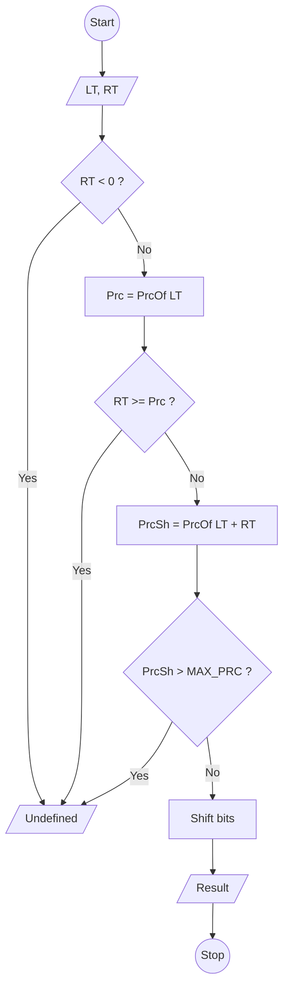

# Bitwise Operators

The following 6 operators are bitwise operators:

## The **Bitwise AND** `&`

It takes two numbers as operands and does AND on every bit of the two numbers. The result of AND is `1` only if the two
operands are `1`.

| A   | B   | AND |
|-----|-----|-----|
| 0   | 0   | 0   |
| 0   | 1   | 0   |
| 1   | 0   | 0   |
| 1   | 1   | 1   |

## The **Bitwise OR** `|`

It takes two numbers as operands and does OR on every bit of the two numbers. The result of OR is `1` if any of the two
bits is `1`.

| A   | B   | OR   |
|-----|-----|------|
| 0   | 0   | 0    |
| 0   | 1   | 1    |
| 1   | 0   | 1    |
| 1   | 1   | 1    |

## The **Bitwise NOT** `~`

It takes one number and inverts all bit of it.

| A   | NOT |
|-----|-----|
| 1   | 0   |
| 0   | 1   |

## The **Bitwise XOR** `^`

It takes two numbers as operands and does XOR on every bit. The result of XOR os `1` if the two bits are different.

> It's the most important operator from a tech. interview perspective.

Below is a list of problems where you can use XOR

- Odd occurring number.
- Find the missing element.
- Swap two numbers without using a temporary variable
- A Memory Efficient Doubly Linked List
- Find the two non-repeating elements.
- Find the two numbers with odd occurrences in an unsorted-array.
- Add two numbers without using arithmetic operators.
- Swap bits in a given number.
- Count number of bits to be flipped to convert a to b.
- Find the element that appears once.
- Detect if two integers have opposite signs.

| A   | B   | XOR |
|-----|-----|-----|
| 0   | 0   | 0   |
| 0   | 1   | 1   |
| 1   | 0   | 1   |
| 1   | 1   | 0   |

## Left shift `<<`

It takes two numbers, left shifts the bits of the first operand, the second operand decides the number of places to
shift.

|     | 8   | 4   | 2   | 1   | Value |
|-----|-----|-----|-----|-----|-------|
|     | 0   | 0   | 1   | 1   | 3     |
|     | ↙   | ↙   | ↙   | ↙   | 3 * 2 |

When we left shift all bits and add `0` at the beginning we have the following value:

|       | 8   | 4   | 2   | 1   | Value |
|-------|-----|-----|-----|-----|-------|
|       | 0   | 0   | 1   | 1   | 3     |
|       | ↙   | ↙   | ↙   | ↙   | 0     |
| ~~0~~ | 0   | 1   | 1   | 0   | 6     |

## Right shift `>>`

It takes two numbers, right shifts the bits of the first operand, the second operand decides the number of places to
shift.

|     | 8   | 4   | 2   | 1   | Value |
|-----|-----|-----|-----|-----|-------|
|     | 0   | 1   | 1   | 0   | 6     |
|     | ↘   | ↘   | ↘   | ↘   | 6 / 2 |

When we right shift all bits and add `0` at the end we have the following value:

|     | 8     | 4   | 2   | 1   | Value |
|-----|-------|-----|-----|-----|-------|
|     | 0     | 1   | 1   | 0   | 6     |
|     | ↘     | ↘   | ↘   | ↘   | 0     |
|     | `0`   | 0   | 1   | 1   | 3     |

> Don't shift an expression by negative number of bits or by greater than or equal to the number of bits that exist in the operand

**Precision** is the number of digits in a number. 
